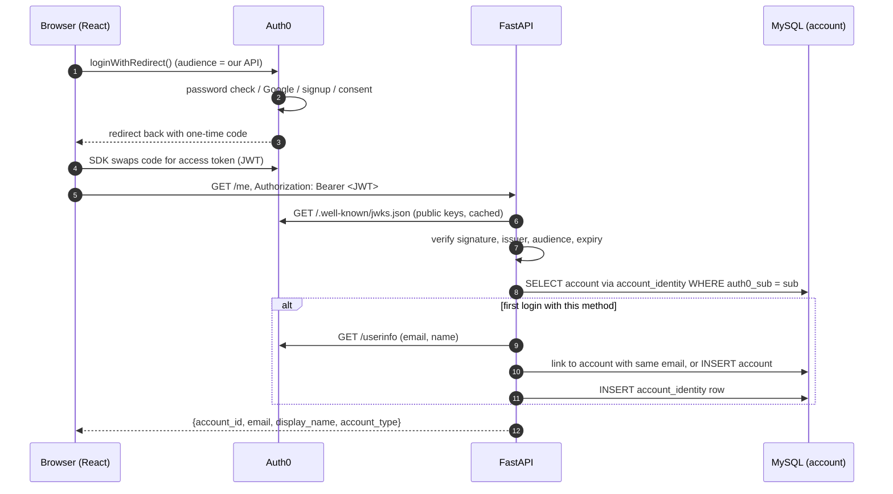
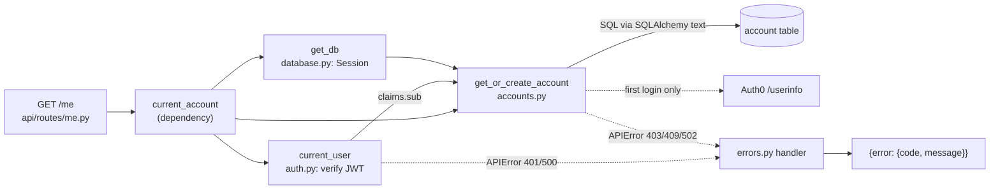
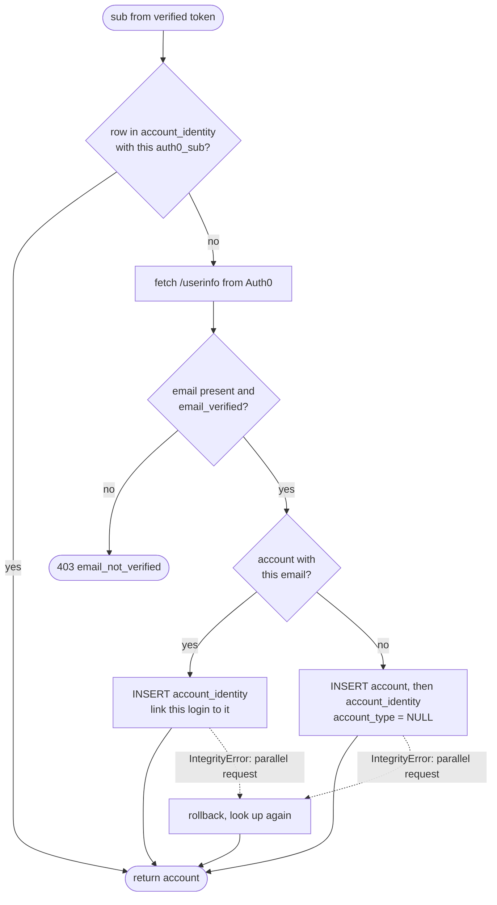
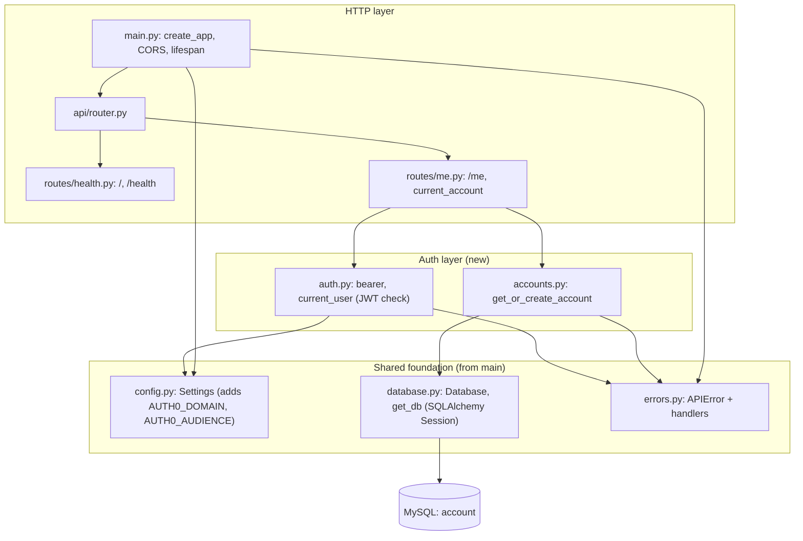

# Authentication and accounts

How login works, how the backend trusts a request, and how a person becomes a row in the `account` table. Auth0 handles passwords and Google sign-in. We never store or see a password.

- **Frontend:** Auth0 login, logout and session restore (`@auth0/auth0-react`).
- **Backend:** verifies the Auth0 access token (JWT), then finds or creates the user's `account` row in MySQL.

## 1. End-to-end login



The backend shares no secret with Auth0. It trusts a token only because the signature verifies against Auth0's published public keys.

## 2. Backend request flow through the layers



`current_account` is the single dependency a route uses to get the logged-in user's account. It runs `current_user` first, so a bad or missing token is rejected before the database is touched.

## 3. `get_or_create_account` decisions



Email/password gives `auth0|...` and Google gives `google-oauth2|...`: different `sub` values for the same person. Each `sub` is a row in `account_identity` (migration `0004`) pointing at one `account`, so a second login method with the same verified email is linked to the existing account instead of failing. Linking requires `email_verified`, otherwise someone could sign up with another person's address and be attached to their account.

## 4. Where auth sits in the backend layers



Auth added two modules (`auth.py`, `accounts.py`), one route module (`routes/me.py`), two settings (`auth0_domain`, `auth0_audience`) and the `pyjwt[crypto]` dependency. It reuses `Settings`, `get_db` and `APIError` and does not replace them.

## 5. Files

### Backend (`backend/app/`)
| File | Role |
|---|---|
| `config.py` | `Settings` read from env/`.env`. Auth fields: `auth0_domain`, `auth0_audience`. |
| `database.py` | `Database` engine and `get_db`, one SQLAlchemy `Session` per request. |
| `errors.py` | `APIError` and handlers; every error is `{"error": {"code", "message"}}`. |
| `auth.py` | `current_user`: reads the bearer token, fetches Auth0's public keys (lazily, cached), verifies RS256 signature, issuer and audience, returns the claims. |
| `accounts.py` | `get_or_create_account(db, domain, sub, token)`: the logic in section 3. |
| `api/routes/me.py` | `current_account` dependency and `GET /me`. |
| `api/router.py` | Registers the health and me routers. |

### Frontend (`frontend/src/`)
| File | Role |
|---|---|
| `main.jsx` | Wraps the app in `Auth0Provider` (domain, client id, redirect URI, audience). |
| `App.jsx` | Reads login state from `useAuth0()`, session restore, logout, shows login page or lobby. |
| `components/LoginPage.jsx` | Log in, Create account (`screen_hint: 'signup'`) and Continue with Google (`connection: 'google-oauth2'`). |
| `components/AccountGate.jsx` | Calls `/me` once logged in (creating the account on first login) before showing the lobby. |
| `api.js` | `apiFetch(path, getToken, options)`: attaches the bearer token and throws `error.message` from the error body. |

## 6. Configuration

Never commit real values. The `.env` files are gitignored; each folder has a `.env.example`.

**Frontend (`frontend/.env`)**
| Variable | Meaning |
|---|---|
| `VITE_AUTH0_DOMAIN` | Auth0 tenant domain |
| `VITE_AUTH0_CLIENT_ID` | Client ID of the Single Page Application |
| `VITE_AUTH0_AUDIENCE` | Identifier of our Auth0 API (e.g. `https://quiz-platform-api`) |
| `VITE_API_BASE_URL` | Backend URL (`http://127.0.0.1:8001` in the example) |

**Backend (`backend/.env`)**
| Variable | Meaning |
|---|---|
| `AUTH0_DOMAIN` | Same tenant domain, no `https://` |
| `AUTH0_AUDIENCE` | Must equal `VITE_AUTH0_AUDIENCE` |
| `CORS_ORIGINS` | Allowed browser origins (default `http://localhost:5173`) |
| `DB_HOST`, `DB_PORT`, `DB_DATABASE`, `DB_USERNAME`, `DB_PASSWORD` | MySQL connection (or `DATABASE_URL`) |

Auth0 dashboard settings for the SPA: `http://localhost:5173` must be allowed as callback, logout and web origin URLs.

## 7. Running locally

```bash
# 1. Database (Docker, no school network needed)
docker run -d --name quizdb-dev -e MYSQL_ROOT_PASSWORD=devpass \
  -e MYSQL_DATABASE=quizdb -p 3307:3306 mysql:8.0
for f in ulugbek-err/migrations/*.up.sql; do
  docker exec -i quizdb-dev mysql -uroot -pdevpass quizdb < "$f" || break
done
# backend/.env: DB_HOST=127.0.0.1 DB_PORT=3307 DB_DATABASE=quizdb DB_USERNAME=root DB_PASSWORD=devpass

# 2. Backend on 8001 (the port the frontend's .env.example expects)
cd backend && source .venv/bin/activate
pip install -r requirements.txt
uvicorn app.main:app --reload --port 8001

# 3. Frontend on 5173
cd frontend && npm install && npm run dev
```

Check: `curl localhost:8001/health` returns database `ok`, and `curl localhost:8001/me` returns 401 `missing_token`. Logging in at http://localhost:5173 creates your row; inspect it with
`docker exec quizdb-dev mysql -uroot -pdevpass quizdb -e "SELECT * FROM account;"`.

The hosted database is a separate, new MySQL built from the same migration files. Only the connection settings change.

## 8. Error responses

Every error has the shape `{"error": {"code": "...", "message": "..."}}`; the frontend shows `message`.

| Status | `code` | When |
|---|---|---|
| 401 | `missing_token` | No `Authorization: Bearer` header |
| 401 | `invalid_token` | Bad signature, wrong audience or issuer, expired, or malformed |
| 500 | `auth_not_configured` | `AUTH0_DOMAIN` or `AUTH0_AUDIENCE` missing on the server |
| 403 | `email_not_verified` | Auth0 profile has no verified email at first login |
| 502 | `profile_unavailable` | Could not reach Auth0 `/userinfo` at first login |

## 9. Behaviors worth knowing

**Dev-only localStorage cache.** `main.jsx` sets `cacheLocation` to `'localstorage'` when `import.meta.env.DEV` is true and `'memory'` otherwise. By default the SDK keeps tokens in memory, so a refresh forgets them and the app asks Auth0 to restore the session silently (`prompt=none`, see `App.jsx`). On localhost that silent check always fails (next item), so in dev the session is cached in localStorage and reloads keep you logged in. Production builds keep tokens in memory, which exposes less to script injection.

**Localhost always shows the consent screen.** Auth0 always asks for consent on `localhost`, even for your own app and even if "Allow Skipping User Consent" is on for the API (it is). This also makes the silent re-login fail with `consent_required`. Deploying to a real domain should remove the screen.

**Back-button mitigation.** `LoginPage.jsx` passes `openUrl: (url) => window.location.replace(url)` to `loginWithRedirect`, so our page is replaced instead of added to history. Auth0's own pages (login, consent) still add entries, and the consent page's one-time state can produce an "Oops, something went wrong" page if you go Back to it. This reduces, but does not fully remove, the problem.

**Duplicate signup message.** Signing up with an existing email shows a message customized in the Auth0 tenant (Universal Login custom text, signup prompt, key `auth0-users-validation`). That setting lives in Auth0, not in this repo.

**Several login methods, one account.** Logging in with Google and with email/password using the same verified email lands on the same `account`. `account.auth0_sub` is only the first login and is not used for lookups.

**Email verification happens once.** Auth0 marks an email verified when the user clicks the link in the verification email, and it stays verified. Users are not asked again. How often they must *log in* is a separate setting (Auth0 session lifetime, tenant settings > Advanced for the SSO session, and the application's refresh-token/absolute lifetime).

**Forgot password.** Auth0's hosted login page has a "Forgot password?" link for the email/password connection and sends the reset email. There is no code for it in this repo.

## 10. Adding a protected route

```python
# backend/app/api/routes/quizzes.py
from fastapi import APIRouter, Depends
from app.api.routes.me import current_account

router = APIRouter(tags=["quizzes"])

@router.get("/quizzes")
def my_quizzes(account: dict = Depends(current_account)):
    # account = {"account_id", "email", "display_name", "account_type"}
    ...
```

Then `include_router` it in `app/api/router.py`. For database access add `db: Session = Depends(get_db)` from `app.database`. On the frontend call it with `apiFetch('/quizzes', getAccessTokenSilently)`.

Use `current_user` instead if you only need the token's claims and no database row.

## 11. Open decisions

- **`account_type` is NULL for everyone.** There is no student/professor chooser. Everyone is a host/participant in the lobby. How professor and administrator status get assigned is undecided.
- **Temporary scaffolding:** none remains in the code. The `/me` check is now `AccountGate`.
