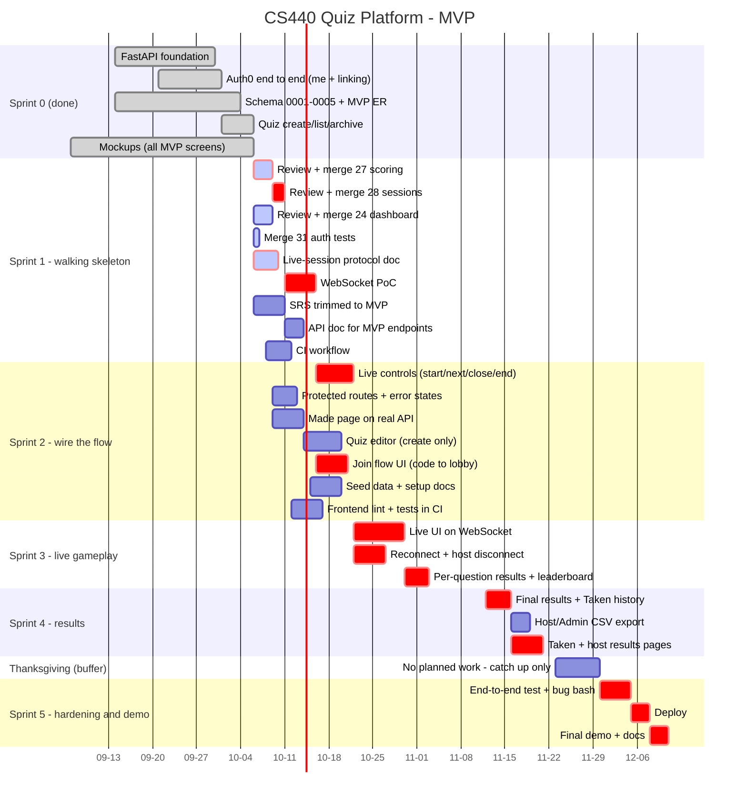
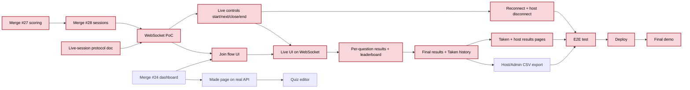

# Roadmap (MVP)

The plan for the rest of the semester (now to about 2026-12-11), trimmed to the **MVP scope** the team agreed on 2026-10-04 (see `ulugbek-err/ER_Diagram.md`). We build a **walking skeleton** first, with every layer connected end to end even if thin. Then we fill in the game one slice at a time. Every task ends in something we can show: a merged PR, a doc, a passing test or a demo.

## MVP in one paragraph

Anyone can log in with Auth0 (Google or email). Every account is a **User**. A few **Admins** are set by hand in the database. Users create quizzes; a saved quiz is published as-is and cannot be edited. Its author can archive it. The author hosts a live session from their quiz and gets a six-digit code. Any logged-in User joins with the code. **Host** and **participant** are things a User does, not roles. The host runs the questions live over WebSocket. Answers are scored on the server, using a score that rewards speed. When the session ends, results are saved. Participants see their own results, and the host and Admins see everyone's. The host or an Admin can export them.

**After the MVP:** Professor/Student roles, authorization helpers for roles, classes and membership, private quizzes, editing saved quizzes and collaborating on them, semester statistics, and an admin dashboard. These are listed in [§5](#5-after-the-mvp) and are left out of the timeline on purpose.

## 1. Where we are (main @ `62eac7e`, 2026-10-06)

| Area | Status | Owner |
|---|---|---|
| FastAPI foundation (config, DB, errors, `/health`) | Done | Anh |
| Auth0 backend + frontend, `/me`, account linking | Done (#21, #22) | Nick |
| MVP roles (User/Admin), active-account check | Done (#26) | Anh |
| Auth tests on protected routes | In review (#31) | Nick |
| Schema `0001`–`0005`, MVP ER diagram, local DB setup | Done | Ulug |
| Quiz create / list / get / archive (no editing in MVP) | Done (#26) | Anh |
| Mockups: in-quiz, dashboard, editor, presenter/participant flows, results | Done (#30 and earlier) | Anh, Taha, Anindo |
| Response submission + speed-based scoring | In review (#27) | Pronob |
| Session create + join (six-digit codes, participants) | In review (#28, stacked on #27) | Anh |
| React dashboard + login restyle (sample data) | In review (#24) | Anindo |
| Live-session protocol + WebSocket | **Not started**: the biggest risk | Nick (proposed) |
| Results, export, CI, seed data, API doc | Not started | — |

## 2. Timeline

Sprints are two weeks. Red bars (`crit`) are the critical path: if one slips, the demo slips. Thanksgiving week (11-23 to 11-29) is a buffer with nothing planned.

## 3. Critical path

Arrows mean "must be done before". Red nodes are on the critical path.

## 4. Tasks by sprint

Owners come from who wrote the related code or claimed it. "Unclaimed" means anyone can take it: put your name in the table in a PR.

### Up next (this week)

1. **Merge #31** (auth tests). It's small and ready now.
2. **Review and merge #27, then #28.** #28 is stacked on #27, so merge #27 first. The WebSocket work builds on both.
3. **Review and merge #24.** Every frontend task in Sprint 2 builds on it.
4. **Nick: write `docs/LIVE_PROTOCOL.md`** while #27 and #28 are in review. Then build the WebSocket PoC on top of them. #28 lists what's missing: moving a session from `LOBBY` to `ACTIVE`, creating `SessionQuestion` rows and opening and closing questions. Those transitions belong in the protocol.

### Sprint 1: walking skeleton (to 10-14)

| Task | Owner | Done when |
|---|---|---|
| Merge #27 response submission + scoring | Pronob | Merged into `main`; unit and MySQL integration tests pass |
| Merge #28 session create/join | Anh | Merged after #27; join codes work end to end |
| Merge #24 React dashboard + login | Anindo | Merged; `npm run lint` and `npm run build` clean |
| Merge #31 auth tests | Nick | Merged; 39 unit tests pass |
| Live-session protocol doc | Nick (proposed) | `docs/LIVE_PROTOCOL.md`: session state diagram (`LOBBY → ACTIVE → ENDED`, question open/closed), every WebSocket event with its payload, and rules for reconnect, duplicate answers (already rejected by #27) and host disconnect |
| WebSocket PoC | Nick (proposed) | Demo: host opens a session, two participants connect, host starts a question, both receive it, a reconnecting client gets the current state; a two-client pytest passes |
| SRS trimmed to MVP | unclaimed | SRS uses Auth0 instead of passwords, User/Admin roles with host/participant as modes, the speed-based scoring rule from #27 with a worked example, and an MVP vs after-MVP list matching §5 |
| API doc for MVP endpoints | unclaimed | `docs/API.md` lists `/me`, `/quizzes`, sessions and responses with request, response and error shapes (FastAPI `/docs` can be the source) |
| CI workflow | unclaimed | GitHub Actions runs backend unit tests and frontend lint/build on every PR |

### Sprint 2: wire the flow (10-15 to 10-28)

| Task | Owner | Done when |
|---|---|---|
| Live controls: start, next question, close question, end session | Nick | Host's WebSocket commands change session/question state in MySQL and broadcast to participants; tests cover wrong-user and wrong-state commands |
| Protected routes + loading/error/unauthorized states | Nick | Logged-out users are sent to login; expired session or inactive account shows a clear screen; shared loading/error/empty components |
| Made page on the real API | Anindo | Dashboard from #24 lists the user's quizzes from `GET /quizzes` and archives through the API, instead of using sample data |
| Quiz editor (create only) | unclaimed | Port `taha/quiz-editor-main.html`: title, multiple-choice questions with 2 to 4 choices, correct answer, timer, points; validation; saves with `POST /quizzes` |
| Join flow UI | unclaimed | Participant enters a code, joins with `POST` from #28, and waits in the lobby (from `anindo/`) until the host starts |
| Seed data + setup docs | Ulug | Script loads demo users, an Admin and two quizzes; README gets a new teammate from clone to running app |
| Frontend lint + tests in CI | unclaimed | Vitest set up with at least one component test, run in CI |

### Sprint 3: live gameplay (10-29 to 11-11)

| Task | Owner | Done when |
|---|---|---|
| Live UI on WebSocket | Anh (in-quiz mockups) | Host and participant screens from `anh/` and `taha/*-flow-main.html` ported to `frontend/` and driven by real events; one host and two participants can play a full game |
| Reconnect + host disconnect | Nick | Refreshing the page resumes the current question; if the host drops, participants see a waiting state and the session can resume or end |
| Per-question results + leaderboard | Pronob | When a question closes, correct answer, points and leaderboard are broadcast (scores are hidden until close, per #27) |

### Sprint 4: results (11-12 to 11-22)

| Task | Owner | Done when |
|---|---|---|
| Final results + Taken history | Pronob | `result` rows are written when a session ends; endpoints return a participant's own history and the host's full session results, following the "who can see results" rules in `ER_Diagram.md` |
| Host/Admin CSV export | unclaimed | Host or Admin downloads one session's results as CSV, with high, average and low scores |
| Taken + host results pages | unclaimed | Port `taha/participant-results-main.html` and `taha/host-results-main.html`; participant reviews their answers, host sees everyone |

### Thanksgiving buffer (11-23 to 11-29)

Nothing planned. Use it only to catch up on slipped work.

### Sprint 5: hardening and demo (11-30 to 12-11)

| Task | Owner | Done when |
|---|---|---|
| End-to-end test + bug bash | everyone | Scripted run of login → create quiz → host → join → play → results → export passes; open bugs triaged |
| Deploy | unclaimed | App reachable at a shared URL with production Auth0 settings |
| Final demo + docs | everyone | Demo rehearsed; README, API doc and protocol doc match what we ship |

## 5. After the MVP

Not on the timeline. We'll pick these up only if the MVP ships early, or next semester. The database already has room for most of them (`account_type` enum, `course_group`, `group_membership`, `quiz_group`, `quiz_collaborator`).

- **Professor/Student roles:** decide how someone becomes a professor, expand `AccountRole`, add shared `require_role` and ownership helpers to replace the inline checks, add role-matrix tests, and show different navigation per role. (The `effective_role` test in #31 will need updating.)
- **Classes:** create a class, join or roster students, class-management UI, sessions tied to a class.
- **Private quizzes:** visibility rules and the professor-of-class access described in `0002_quizzes`.
- **Editing saved quizzes:** new versions on edit, drafts, collaborators.
- **Statistics:** per-student exports, semester reports, score distributions.
- **Admin dashboard:** view all users, classes and quizzes.

## 6. Notes

- **Dates are proposals.** Adjust them at the next team meeting, then update this file.
- **Owners are inferred from commits and open PRs**, not assigned. "Nick (proposed)" means Nick plans to take it.
- `docs/AUTH.md` still says "every route should treat all accounts the same". Since #26 added Admin, that line needs a small update.
