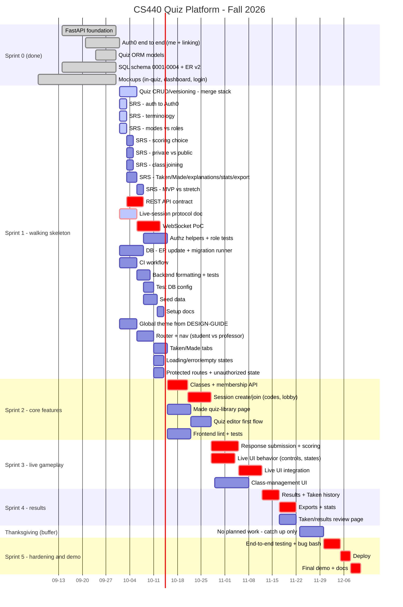
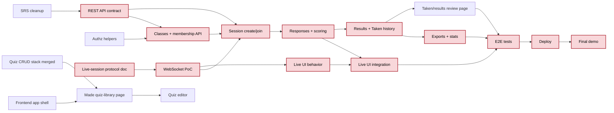

# Roadmap

The plan for the rest of the semester (2026-10-01 to about 2026-12-11). We build a **walking skeleton** first: every layer connected end to end, even if thin. Then we add features one vertical slice at a time. Every task ends in something we can show: a merged PR, a doc, a passing test or a demo.

## 1. Where we are (main @ `b2973d0`, 2026-10-01)

| Area | Status | Owner (git evidence) |
|---|---|---|
| FastAPI foundation (config, DB session, errors, `/health`) | Done | Anh |
| Auth0 backend + frontend, `/me`, account linking | Done (#21, #22) | Nick |
| Quiz ORM models | Done (#13) | Anh |
| SQL schema `0001`–`0004` + ER diagram v2 | Done as hand-run SQL; needs ER refresh + a migration runner | Ulug |
| Quiz CRUD → publish → versioning | Written, **not merged**: stacked PRs #16–#20 (`feature/quiz-list-archive` … `feature/quiz-versioning`) | Anh |
| Mockups: in-quiz host/participant (`anh/`), dashboard + design guide (`taha/`), login/lobby (`anindo/`) | Done | Anh, Taha, Anindo |
| Classes, sessions/joining, WebSocket, scoring, results, exports | Not started (tables exist) | — |
| SRS cleanup, REST API contract, live-session protocol doc | Not started | — |
| CI, frontend tests, seed data, app shell/router | Not started | — |

## 2. Timeline

Sprints are two weeks. Red bars (`crit`) are the critical path: if one slips, the demo slips. Thanksgiving week (11-23 to 11-29) is a buffer with nothing planned.

## 3. Critical path

Arrows mean "must be done before". Red nodes are on the critical path.

## 4. Tasks by sprint

Owners come from who has committed related work. "Unclaimed" means nobody has touched it yet, so anyone can take it.

### Sprint 0: done (through 09-30)

| Task | Owner | Done when |
|---|---|---|
| FastAPI foundation | Anh | `/health` returns DB status on `main` (done) |
| Auth0 end to end, `/me`, account linking | Nick | Login works and `/me` returns the account; #21 and #22 merged (done) |
| Quiz ORM models | Anh | #13 merged (done) |
| SQL schema `0001`–`0004` + ER v2 | Ulug | Migrations in `ulugbek-err/migrations/` run cleanly on MySQL 8 (done) |
| Mockups: in-quiz, dashboard + design guide, login/lobby | Anh, Taha, Anindo | `anh/`, `taha/`, `anindo/` on `main` (done) |

### Sprint 1: walking skeleton (10-01 to 10-14)

| Task | Owner | Done when |
|---|---|---|
| Quiz CRUD/versioning: merge the stack (#16–#20) | Anh | All five PRs merged in order; quiz tests pass on `main` |
| SRS: auth section rewritten for Auth0 | unclaimed | SRS PR replaces the old password/login section with the Auth0 flow |
| SRS: terminology | unclaimed | Glossary section; one term per concept (quiz, version, session, class/group) used throughout |
| SRS: modes vs roles | unclaimed | SRS states which are roles (student, professor) and which are modes (host, participant) |
| SRS: scoring choice | unclaimed | One scoring rule written down with a worked example |
| SRS: private vs public quizzes | unclaimed | Visibility rules written down, matching `quiz_group` |
| SRS: class joining | unclaimed | How a student joins a class (code, invite or roster) written down |
| SRS: Taken/Made/explanations/stats/export | unclaimed | Each page's contents, answer explanations, stats and export formats written down |
| SRS: MVP vs stretch | unclaimed | Every requirement tagged MVP or stretch; team agrees in a meeting |
| REST API contract | unclaimed | `docs/API.md` (or OpenAPI) lists every MVP endpoint with request, response and error shapes |
| Live-session protocol doc | Nick (proposed) | `docs/LIVE_PROTOCOL.md` has a state diagram, every event with its payload, and rules for reconnect, duplicate answers and host disconnect |
| WebSocket PoC | Nick (proposed) | Demo: host creates a session, two clients join, host starts a question, both receive it, a reconnecting client gets current state; a two-client pytest passes |
| Authorization helpers + role tests | Nick | `require_role` and ownership checks merged, with tests for missing, invalid, valid and wrong-role tokens |
| DB: ER update + migration runner | Ulug | `ER_Diagram.md` matches `0004`; one command applies pending migrations and records them in `schema_migrations` |
| CI workflow | unclaimed | GitHub Actions runs lint and tests on every PR |
| Backend formatting + tests | unclaimed | Formatter/linter config committed; `pytest` runs green in CI |
| Test DB config | unclaimed | Tests use a separate database (Docker MySQL or env var), never the shared `cray` DB |
| Seed data | unclaimed | Script loads demo accounts, a class, and two published quizzes |
| Setup docs | unclaimed | A new teammate goes from clone to running app + seeded DB using only `README.md` |
| Global theme from `taha/DESIGN-GUIDE.md` | Taha | One global stylesheet with the design tokens, imported by `frontend/` |
| Router + nav (student vs professor) | unclaimed | `react-router` in place; nav shows different links per role |
| Taken/Made tabs | unclaimed | Tabs switch between two routed (empty) pages, styled per the design guide |
| Loading/error/empty states | unclaimed | Shared components used by at least one page, shown at 390px width |
| Protected routes + unauthorized state | Nick | Logged-out users are sent to login; wrong role sees an "unauthorized" screen |

### Sprint 2: core features (10-15 to 10-28)

| Task | Owner | Done when |
|---|---|---|
| Classes + membership API | unclaimed | Professor creates a class, students join it, roster endpoint works; tests pass |
| Session create/join (codes, lobby) | unclaimed | Host creates a session from a published version, gets a join code; participants join and appear in the lobby |
| Made quiz-library page | Taha | Lists the user's quizzes from the API (mock data first), with create, open and archive |
| Quiz editor first flow | unclaimed | Create a quiz, add multiple-choice questions, publish; demo end to end against the API |
| Frontend lint + tests | unclaimed | `npm run lint` clean; a test runner (e.g. Vitest) with at least one component test, run in CI |

### Sprint 3: live gameplay (10-29 to 11-11)

| Task | Owner | Done when |
|---|---|---|
| Response submission + scoring | unclaimed | Answers saved once per participant per question; scores match the SRS rule; tests cover late and duplicate answers |
| Live UI behavior (presenter/participant controls, reconnecting, waiting, ended states) | Anh (in-quiz mockups), Anindo (lobby) | Each screen from `anh/` and `anindo/` ported to `frontend/` and driven by fake events |
| Live UI integration | Anh | Demo: a full game with one host and two participants over the real WebSocket |
| Class-management UI | unclaimed | Professor creates a class and sees its roster; student joins with a code |

### Sprint 4: results (11-12 to 11-22)

| Task | Owner | Done when |
|---|---|---|
| Results + Taken history (incl. presenter/professor results) | unclaimed | `result` rows written when a session ends; endpoints for a student's history and a host's session results |
| Exports + stats | unclaimed | Per-quiz and per-student CSV export with high, average, low and distribution |
| Taken/results review page | unclaimed | Student reviews a finished quiz with their answers and explanations |

### Thanksgiving buffer (11-23 to 11-29)

Nothing planned. Use it only to catch up on slipped work.

### Sprint 5: hardening and demo (11-30 to 12-11)

| Task | Owner | Done when |
|---|---|---|
| End-to-end testing + bug bash | unclaimed | Scripted run of login → create quiz → host → play → results passes; open bugs triaged |
| Deploy | unclaimed | App reachable at a shared URL with the production Auth0 settings |
| Final demo + docs | unclaimed | Demo rehearsed; README and docs match what we ship |

## 5. Notes

- **Dates are proposals.** Adjust them at the next team meeting, then update this file.
- **Owners are inferred from commit history**, not assigned. "Nick (proposed)" means Nick plans to take it. To claim an "unclaimed" task, put your name in the table in a PR.
- In the timeline, "Quiz CRUD/versioning – merge stack" covers both the "merge the versioning stack" and "backend quiz CRUD/versioning" items, since they are the same code.
