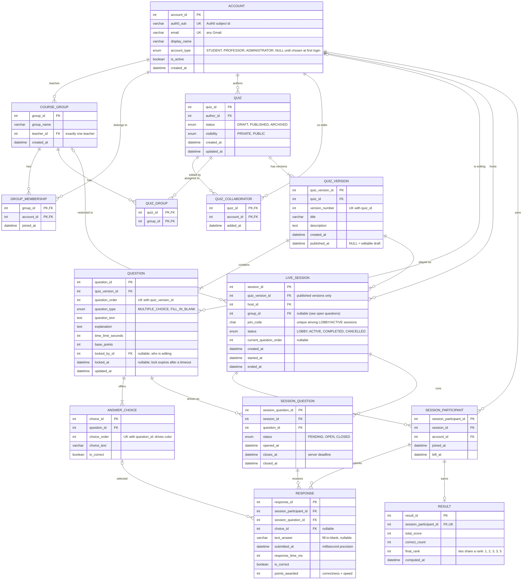

# Quiz Platform — ER Diagram (v2)

This is the plan for our MySQL database: what tables we have and how they connect.

## Diagram

## Things that must be unique

- **account:** no two accounts can have the same Auth0 id or the same email.
- **group_membership:** a student can only be in the same group once.
- **quiz_collaborator:** a person can only be added to the same quiz once.
- **quiz_group:** a quiz can only be linked to the same group once.
- **quiz_version:** a quiz can't have two versions with the same number.
- **question:** two questions in the same version can't have the same position.
- **answer_choice:** two answers to the same question can't have the same position.
- **live_session:** two sessions that are still running can't share a join code. Once a session ends, its code can be used again.
- **session_participant:** a person can only join the same session once.
- **session_question:** a question only shows up once per session.
- **response:** a person can only answer each question once.
- **result:** each participant gets one final result.

## What changed from the first draft

### Renamed tables and columns

- `GROUP` is now `COURSE_GROUP`. `GROUP` is a reserved word in MySQL and causes errors.
- `SESSION` is now `LIVE_SESSION`.
- `rank` is now `final_rank`, `ranking_points` is now `total_score`, and `position` is now `question_order`.

### Login

- We use Google login through Auth0, so we don't store usernames or passwords. An account is identified by its Auth0 id and email.
- There are three account types: Student, Professor, and Administrator.
- When someone logs in for the first time, they pick Student or Professor. Until then, their account type is empty.
- Administrators are our team. We set that by hand in the database.
- "Participant" and "Presenter" aren't account types. They're just what someone is doing in a given session.

### Quiz versions

- A quiz now has versions: `QUIZ` → `QUIZ_VERSION` → `QUESTION`.
- A version that hasn't been published yet can still be edited. Once it's published, it's locked.
- If someone edits a published quiz, we make a new version instead of changing the old one.
- A session always points to the exact version that was played. That way, editing a quiz later never changes old results.
- The title and description moved to the version, so old sessions keep the title they had when they were played.

### Editing quizzes together

- New `QUIZ_COLLABORATOR` table. It lists the students who can edit a quiz besides the author.
- The professor of the quiz's group can also edit it. We don't need extra rows for that; the backend checks the group's teacher.
- Two people can't edit the same question at the same time. The `locked_by_id` and `locked_at` columns on `QUESTION` show who is editing it.
- If someone closes their browser while editing, the lock runs out after a while so the question isn't stuck.

### New quiz and question fields

- `QUIZ` has `visibility` (Private or Public) and `status` (Draft, Published, or Archived). They're separate because a published quiz can still be private.
- Public means everyone in the quiz's group can see it, not everyone on the site.
- `QUIZ` has `created_at` and `updated_at`.
- New `QUIZ_GROUP` table. It links a quiz to one or more groups.
- `QUESTION` has a `question_type` and an `explanation`. The explanation is shown after the question ends.
- `ANSWER_CHOICE` has a `choice_order`. We removed the `color` column. The color comes from the order, so the colors always match what's on screen.

### Live sessions

- `LIVE_SESSION` now has a `status`, the current question number, a `created_at` time, and an optional group.
- New `SESSION_PARTICIPANT` table. It saves everyone who joined, even people who never answered anything.
  - It also stops someone from joining twice and lets people rejoin after refreshing the page.
  - Whether someone is currently connected is tracked by the server, not saved in the database. Saving it would mean writing to the database every few seconds.
- New `SESSION_QUESTION` table. It saves when each question opened, when time runs out (`closes_at`), and when it actually closed.
  - This follows the order we agreed on: Lobby → Question Open → Question Closed → Feedback.
  - The server uses `closes_at` to reject answers that come in too late.

### Answers and results

- `RESPONSE` now points to the participant and the session question.
- We removed `session_id` from `RESPONSE` because we can already get it through the session question.
- Each person can only answer each question once.
- Each answer saves whether it was right, how many points it got, and how fast it was. These are saved when the answer comes in, so changing the scoring formula later won't change old scores.
- `RESULT` points to the participant and saves the total score, number of correct answers, and final place.
- `GROUP_MEMBERSHIP` now has a `joined_at` time.

## Rules the backend has to check

The database can't easily check these, so the backend code has to:

- **Who can host:** only the quiz's author, its collaborators, or the group's professor. The host only presents and doesn't play.
- **Who can join:** if a session belongs to a group, only students in that group can join.
- **Who can see a quiz:** everyone in the group can see public quizzes. Only the author, collaborators, and the professor can see private ones.
- **Matching data:** a session can only show questions from the version it's playing, and an answer has to be one of that question's choices.
- **Published versions:** they can't be edited.
- **Ties:** people with the same score get the same place, and the next place is skipped. For example: 1st, 2nd, 3rd, 3rd, 5th.
- **Joining late:** people who join late get 0 points for questions that already ended.

## What we've decided

- **Scoring:** points depend on being correct and on how fast you answer.
- **Teachers:** each group has one teacher.
- **Login:** Google login through Auth0. Any Gmail account works.
- **Account type:** picked at first login (Student or Professor). Our team are the admins.
- **Editing together:** the student group that made the quiz and their professor can edit it, but only one person per question at a time.
- **Who sees quizzes:** only people in the quiz's group.
- **Hosting:** students can host their group's quizzes, and professors can host too. The host doesn't play.
- **Group sessions:** only group members can join.
- **Ties:** same place, and the next place is skipped.

## Still to decide

1. **Adding students by Gmail.** What if the student hasn't logged in yet, so they don't have an account? One idea is a `GROUP_INVITE` table that saves the email and adds the student to the group when they first log in.
2. **Sessions without a group.** Can someone run a session with just a join code? For now, a session's group is optional.
3. **The speed formula.** Kahoot uses `base points × (1 − (time taken ÷ time limit) ÷ 2)`. Any formula works with this database design, but we need to pick one.
4. **Excel export.** It'll probably show both the number of correct answers and the score for each day. We should check with the client.

## Concerns

- **Anyone can pick Professor.** If people choose their own role, a student could pick Professor and see everyone's grades. We could make new professor accounts wait until one of us approves them.
- **Shared database.** We should agree on who is allowed to run migrations on the shared `cray` database.
