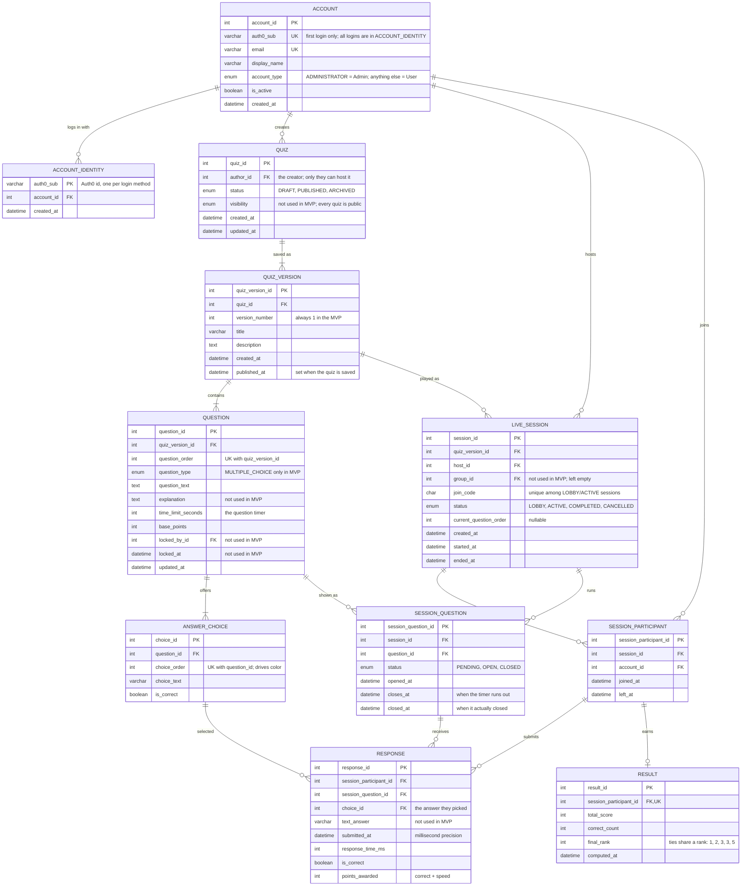

# Quiz Platform — ER Diagram (MVP)

This is the plan for our MySQL database: what tables we have and how they connect.

It follows the MVP scope we agreed on at the October 4, 2026 meeting. The MVP is one full flow: sign in, create a quiz, host a session, people join and answer, the session ends, and people can look at the results and export them to Excel.

The database has a few more tables than the MVP needs. They were built for the bigger semester plan (classes, working on a quiz together). We're leaving them in the database so nothing breaks, but the MVP doesn't use them. They're listed in [Tables the MVP doesn't use](#tables-the-mvp-doesnt-use).

## Diagram

This shows only the tables the MVP uses.

## How the MVP uses each table

### Accounts and roles

- People sign in through Auth0. We don't store passwords.
- `account` has one row per person. `account_identity` has one row for each way that person has logged in (for example Google and email/password).
- The MVP has two roles: **User** and **Admin**.
  - The `account_type` column was built for Student, Professor and Administrator. We're not changing the column, because the login code already reads it.
  - For the MVP: `ADMINISTRATOR` means Admin. Anything else (including empty) means User.
  - To make someone an Admin, we set `account_type = 'ADMINISTRATOR'` by hand in the database.
- Hosting and joining are things a User does. They aren't roles, so they aren't stored on the account.
- Everyone is in one shared class. There's no class table in the MVP, so "in the class" just means "has an account".

### Quizzes

- A quiz is saved as `quiz` → `quiz_version` → `question` → `answer_choice`.
- Saved quizzes can't be edited in the MVP, so every quiz has just one version (version 1).
- We're keeping the version table because the quiz code is already built on it, and it's what will let us add editing later without changing old results.
- Every quiz is public to everyone. The backend should ignore the `visibility` column for now.
- Only the person who made the quiz (`author_id`) can host it. Being able to see a quiz doesn't mean you can host it.
- Each question has its own timer (`time_limit_seconds`), its answer choices, and which choices are correct.

### Hosting and joining

- When the creator hosts a quiz, we add a row to `live_session` with a new join code.
- Hosting the same quiz again adds a new `live_session` row. Each session keeps its own results.
- Anyone who is logged in can join with the code. Joining adds a row to `session_participant`. This is what the host's lobby shows.
- The host doesn't play, so the host is never in `session_participant`.
- `live_session.group_id` is left empty. Migration `0005` made it optional for this reason.

### Running the quiz

- When a question starts, we add a row to `session_question` with the time it opened and the time its timer runs out (`closes_at`).
- A question closes when the timer runs out or when everyone has answered. `closed_at` saves when that happened.
- Each answer is a row in `response`. A person can only have one answer per question, so their first answer is final and a second one is rejected.
- An answer that comes in after `closes_at` is rejected by the backend.

### Scores and results

- Each `response` saves whether it was right, how fast it was, and how many points it got. Faster correct answers get more points. The formula is the one in the semester SRS.
- These are saved when the answer comes in. If we change the formula later, old scores stay the same.
- When the session ends, we add one `result` row per participant with their total score, how many they got right, and their final place.
- People with the same score get the same place, and the next place is skipped. For example: 1st, 2nd, 3rd, 3rd, 5th.
- The Excel export for one session reads from `session_participant`, `question`, `response` and `result`, so it always matches what the app shows.

## Things that must be unique

- **account:** no two accounts can have the same email.
- **account_identity:** an Auth0 id belongs to exactly one account, but an account can have several.
- **quiz_version:** a quiz can't have two versions with the same number.
- **question:** two questions in the same quiz can't have the same position.
- **answer_choice:** two answers to the same question can't have the same position.
- **live_session:** two sessions that are still running can't share a join code. Once a session ends, its code can be used again.
- **session_participant:** a person can only join the same session once.
- **session_question:** a question only shows up once per session.
- **response:** a person can only answer each question once.
- **result:** each participant gets one final result.

## Rules the backend has to check

The database can't easily check these, so the backend code has to:

- **Who can host:** only the person who made the quiz.
- **Who can join:** anyone who is logged in. The host can't join their own session as a player.
- **Who can see results:**
  - A participant can see their own answers and score for a session they took.
  - The host can see everyone's answers and scores for a session they hosted.
  - An Admin can see everything.
  - Being able to see a quiz doesn't let you see other people's results.
- **Who can export:** the host of the session, or an Admin.
- **Matching data:** a session can only show questions from the quiz it's playing, and an answer has to be one of that question's choices.
- **No editing:** once a quiz is saved, it can't be changed.
- **Late and repeat answers:** both are rejected.
- **Joining late:** people who join late get 0 points for questions that already ended.

## Tables the MVP doesn't use

These tables exist in the database but the MVP doesn't read or write them. Please don't delete them. They'll be used when we build the features below.

| Table | What it's for | Needed when we add |
|---|---|---|
| `course_group` | A class, with one teacher | Multiple classes |
| `group_membership` | Which students are in which class | Multiple classes |
| `quiz_group` | Which classes a quiz belongs to | Multiple classes, private quizzes |
| `quiz_collaborator` | Extra people who can edit a quiz | Working on a quiz together |

Some columns are also unused for now: `quiz.visibility`, `question.explanation`, `question.locked_by_id`, `question.locked_at`, `response.text_answer`, and `live_session.group_id`.

## Left for after the MVP

- Multiple classes, adding students to a class, and class management.
- Professor roles and anything only a professor can do.
- Private quizzes.
- Editing a saved quiz, and working on a quiz together.
- Semester reports and other statistics.
- An admin dashboard.

## Concerns

- **Which database do we use?** For day-to-day work, everyone should use their own database on their laptop. See [`LOCAL_DATABASE_SETUP.md`](LOCAL_DATABASE_SETUP.md). Ulugbek owns the database design and the migrations, so changes to tables go through him.
- **How do we make an Admin?** Right now it's a manual change in the database. That's fine for the MVP, but we should write down who the Admins are.
